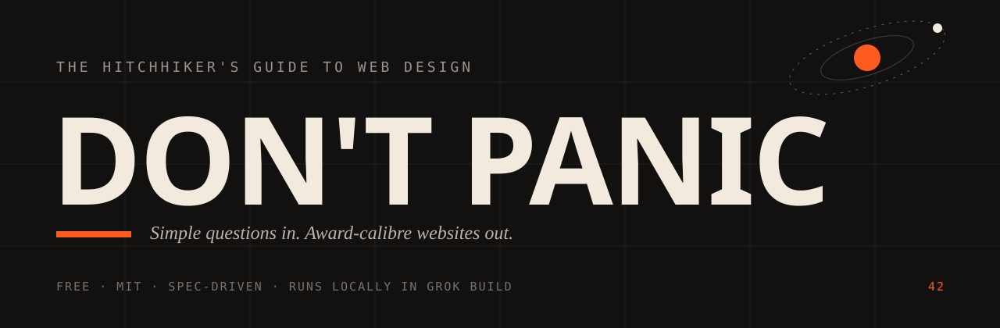
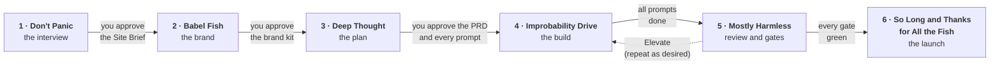

<div align="center">



# The Hitchhiker's Guide to Web Design

**Don't Panic.** A free, open-source, spec-driven website builder that interviews you like the world's best brand agency,<br>then builds Awwwards-level sites with Grok 4.7.

[](LICENSE)
[](https://x.ai)
[](#built-on-gsd)
[](#roadmap)
[](https://github.com/kr8tiv-ai/hitchhikers-guide-to-web-design/actions/workflows/ci.yml)
<br>
[](#roadmap)

<br>

> ### *"Feels like a 2-hour meeting with the greatest brand agency on the planet,<br>using the greatest AI on the planet."*
> The north star, as set by Matt Haynes

<br>

[What it is](#what-is-this-exactly) ·
[How it works](#how-it-works-six-phases) ·
[The Guide](#meet-the-guide) ·
[Motion](#the-motion-toolkit) ·
[Anti-slop](#the-anti-slop-rules) ·
[Quick start](#quick-start) ·
[Roadmap](#roadmap) ·
[FAQ](#faq)

</div>

<br>

## You've arrived early

Like, "the paint is still wet and the AI is holding the brush" early.

The Hitchhiker's Guide to Web Design is in this repo, still pre-alpha, still being built by Grok 4.7 inside Grok Build, from a specification so thorough it has its own table of contents, its own research department and, at one point, its own opinion about kerning. The six phases are in the tree. The package version is still `0.0.0`. Repository: [github.com/kr8tiv-ai/hitchhikers-guide-to-web-design](https://github.com/kr8tiv-ai/hitchhikers-guide-to-web-design).

Star the repo, watch it happen, and bring a towel. Things are about to get improbable.

---

## What is this, exactly?

Most AI website builders work like a vending machine. You type "bakery website", something drops out of the slot, it has a purple gradient and three feature cards with icons, and everyone agrees to pretend this is fine.

This one works the other way round.

Before a single line of code is written, the Guide sits you down for a long, funny, slightly obsessive conversation, the kind a top brand agency would bill you a small moon for. It works out who you are, who you're for, what you want visitors to actually *do*, and what your site should *feel* like. Then it turns all of that into a real brand, a real spec and a stack of 50 to 150 carefully written build prompts. Finally it drives Grok 4.7 through every one of them, with a reviewer checking the work and a watchdog catching errors before you notice them.

**Simple questions go in. Very technical, award-calibre websites come out.**

| | |
|---|---|
| **Free and MIT-licensed** | Forever. No SaaS, no paywall, no "Pro" tier lurking behind a modal with a countdown timer. |
| **Local-first** | Runs on your own machine inside Grok Build, on your own SuperGrok plan. Your code, your repo, your hosting. |
| **Spec-driven to the bone** | Every decision lives in plain files modelled on [GSD](#built-on-gsd). Every build prompt runs in a fresh session. Nothing is left to vibes. |
| **Agency-grade discovery** | Brand, voice, positioning, goals, KPIs, competitors, SEO, taste, motion appetite, budget, deadline. The lot. |
| **Award-level output** | GSAP, Three.js, shaders and friends, applied with taste and policed by a strict anti-slop rulebook. |
| **You own everything** | Deploy wherever you like. Hostinger first, plus Vercel, Netlify and Cloudflare. |

**What it isn't:** a hosted builder, a drag-and-drop editor, a template store, or a paid SaaS. Think of it as an open-source agency in a box. The box contains a towel.

---

## Who it's for

**Beginners and new entrepreneurs.** You have an idea, a logo you sketched on a napkin, and no idea what ScrollTrigger is. Perfect. You're exactly who this was built for. The Guide explains every term in two sentences or fewer, offers *Suggest for me* on every single question, and puts real example sites in front of you instead of asking you to imagine them.

**Agencies.** You have clients, deadlines and a faint twitch whenever someone says "can we make it pop?" There's a condensed interview mode, you can import a client's brief or brand guide and skip straight to the gaps, and you get client-presentable PRDs and brand kits at the end. Several projects can live in one workspace.

**Designers and developers.** You know exactly what an easing curve is, and you have *feelings* about it. Every spec file is plain text you can edit. The framework choice is explained and overridable. Motion IDs, effort routing and the prompts themselves are all exposed. The Guide notices when you say "INP" or "R3F" and quietly stops explaining the basics.

**Everyone else.** Anyone who has looked at an AI-generated website and thought, "I have seen this exact page four hundred times." Welcome. You're among friends.

The very first thing the Guide asks is how comfortable you are with web stuff, on a scale from *towel-less hitchhiker* to *Slartibartfast*. It keeps adjusting as you talk, in both directions, without making a fuss about it.

---

## How it works: six phases

Every site travels through six phases. Each one ends with you approving something, and each new phase opens with a short **"Before we jump"** round of follow-up questions based on what the previous phase produced. ("Your brand says *calm*, but you picked motion level 9. Want a calm 9, or shall we talk about it?")



### 1. Don't Panic: the interview
> *The longest, most enjoyable meeting you will ever attend, and you can do it in your pyjamas.*

A deep, skippable interview: your experience and any previous sites, brand and assets, why the site exists, what counts as success (sales, bookings, calls, leads, art, content, or several at once), the KPIs behind it, competitors (crawled for you), SEO and blogging, taste, motion appetite, 3D, budget, deadline and hosting. You can feed it PDFs, screenshots, website URLs, images, Pinterest boards, competitor sites and existing brand guides. It saves as you go and resumes whenever you come back. It finishes by writing a Site Brief and asking the most important question in design: *"What did I get wrong?"*

### 2. Babel Fish: the brand
> *Translates the noises you make about your business into a brand other people can understand.*

The why behind the business, archetype and positioning, ideal customer, palette, typography, imagery, and a full voice guide with slogans, tagline and banned words. The logo is made with Grok Imagine and delivered as a clean SVG. Weak images get graded, upscaled or replaced, because nobody needs a blurry hero. Already have a brand? Upload it and skip ahead. The Guide will still ask, "Happy with this?", and offer to make it better. It can be quite persuasive about that.

### 3. Deep Thought: the plan
> *Thinks extremely hard up front, so the build never has to guess.*

The PRD, requirements, roadmap, motion spec, section plan, visual direction and one genuinely massive context document. Grok picks the right framework for the job (Astro, Next.js, SvelteKit and so on), explains why, lists the alternatives and trade-offs, and lets you argue. Then it writes the whole prompt package, 50 to 150 prompts written specifically for Grok 4.7. You approve all of it before anything gets built.

### 4. Improbability Drive: the build
> *Makes the wildly improbable happen on schedule, one commit at a time.*

The orchestrator runs every prompt in a fresh Grok Build session, picking the model and effort level per prompt. One prompt is one job is one commit. Every three prompts the reviewer takes desktop and mobile screenshots, checks them against the spec and fixes what's off. The watchdog watches for errors and stalls, fixes the small stuff immediately, escalates only when it genuinely has to, and can roll back to the last reviewed commit. You get progress updates the whole way, and a proper reveal at the end.

On this repo, the prompt queue is walked by [`.hh-driver/run-build.ps1`](.hh-driver/README.md) on Windows and by `node .hh-driver/run-build.mjs` on macOS and Linux. Same rules: one prompt per session, a normal `git push`, never a force push. `/hh-drive` is a skill you type. It is not an `hh` subcommand.

### 5. Mostly Harmless: the review
> *We aim considerably higher than the name suggests.*

Hard quality gates, an anti-slop audit, and a jury of three Awwwards-style judges scoring design, usability, creativity and content, with strict instructions that if it's a 6, they say 6. Then comes the [Elevate loop](#the-elevate-loop), which you can run as many times as you like.

### 6. So Long and Thanks for All the Fish: the launch
> *Your site leaves the nest. We wave a small, sentimental towel.*

Deploys to Hostinger, Vercel, Netlify or Cloudflare with your explicit go-ahead, and writes a `DEPLOY.md` with the manual steps too. Then it runs post-deploy checks on the live site, puts together a launch kit (OG images, launch posts in your brand voice, an announcement email), writes a handoff doc, and leaves you a ranked list of post-launch upgrades for when you're ready for round two.

### The crew

| Name | Job | Personality |
|---|---|---|
| **The Guide** | Interviewer | Funny, artsy, precise, kind, and impossible to fob off with "modern". |
| **Deep Thought** | Planner | Takes the big questions seriously so you don't have to. |
| **Eddie** | Orchestrator | Relentlessly cheerful progress updates. Has never once had a bad day. |
| **Zaphod** | Reviewer | Two heads, two viewports: desktop and mobile. Misses very little. |
| **Marvin** | Watchdog | Sees every error. Enjoys none of them. Fixes them anyway. |

---

## Meet The Guide

The interviewer is the heart of the whole thing, so it got a proper character sheet.

**The Guide is funny** in a dry, absurdist, never-mean way, at roughly one joke per three or four messages and never when you're stressed. **It's artsy**: it talks about light, rhythm, tension and negative space, and it gets visibly excited about good typography. **It's a bit autistic, on purpose and with affection**: literal precision ("When you say *modern*, do you mean 2026-modern, mid-century-modern or *Tron*-modern?"), a talent for spotting patterns ("You've said *calm* four times and sent me three neon sites. Let's talk about that."), deep special interests in kerning and easing curves, and info-dumps politely capped at three sentences with an offer to say more. **It's friendly and pushy**: it pushes back on vague answers every time, holds the line twice, then accepts your answer and notes it for later. **And it's kind about skipping.** Towels are optional, technically.

A taste of the conversation:

> **The Guide:** Right. Three words for how the site should *feel*. Not what it does. How it feels. (If you say "clean", I will gently lie down on the floor.)
>
> **You:** Clean, modern, premium.
>
> **The Guide:** I'm on the floor. Let's sharpen it. Is *premium* more like a quiet apothecary on warm paper, or more like a sports car on a wet track at night? Or tap *Suggest for me* and I'll pull up four real sites and we'll walk through them together.

**House rules the Guide lives by:**

- **One question at a time.** No forms with forty fields. It's a conversation.
- **Every question has three answers:** `Answer` · `Suggest for me` · `Skip`. Skipped items get sensible defaults, clearly marked as assumptions in the spec so nothing sneaks through. On the card, a Suggest or a Skip that writes a stand-in is labelled `Assumed:`, and the kind is suggested or skipped. A required question asks you to choose Skip again before that assumption is written.
- **The card shows where you are.** The kicker is the question id, the index of the total, and the phase, plus how many required questions are still open, and the interview mode. The client does not recount.
- **"Suggest for me" is grounded.** Two to four concrete options based on everything it already knows about you. For taste questions it pulls real example sites (two from Godly, two from Awwwards) as clickable links and walks you through what's happening in each one.
- **It mirrors you back.** Every eight questions or so you get a three-line "here's what I think I heard".
- **It never lectures.** Two sentences of explanation for beginners, none at all for pros.
- **It speaks your language.** Literally. Talk to it in Spanish and it replies in Spanish.

---

## Talk to it

You can talk the whole way through. Hold the push-to-talk button, ramble about your business like you would to a friend at a bar, let go. Plenty of the best brand insights hide in rambling.

- **Browser speech (default, free to you).** When the browser exposes speech recognition, the desk uses it. The label reads `Voice: browser (free)`. Chrome and Edge do this. The browser vendor processes the audio, so it may leave the machine. It does not spend an xAI key. The order is in [docs/voice.md](docs/voice.md).
- **Local whisper, when the browser cannot listen.** If speech recognition is missing and [whisper.cpp](https://github.com/ggml-org/whisper.cpp) is already installed, the label reads `Voice: local whisper`. The app does not download the binary or the weights.
- **xAI speech-to-text (optional).** The settings screen at `/settings` shows the rate before it can be turned on: $0.10 per hour for REST and $0.20 per hour for streaming. Both the xAI setting and the accepted rate have to be on. Otherwise speech stays on the browser, then local whisper, then typing. The paid path that ships is REST. This client does not open the streaming socket. The same screen holds the model and the effort for the project.
- **The Guide replies in text.** That saves your tokens, you can skim it, and frankly the Guide types faster than it talks.

---

## Difficulty tiers

Every build prompt gets a difficulty tier, which decides how much brainpower it receives. Easy work gets medium effort; hard work gets high or extra-high. You can override any of it, globally or per prompt.

| Tier | Name | Typical work | Default effort | In a sentence |
|:---:|---|---|---|---|
| 1 | **Towel** | Config, file moves, credits entries, copy placement, small fixes | `medium` | Small, essential and wildly underestimated. |
| 2 | **Cup of Tea** | Simple sections, navigation, forms, SEO tags | `medium` | Comforting, familiar, and surprisingly hard to get exactly right. |
| 3 | **Gargle Blaster** | Motion systems, reveals, smooth scroll, transitions, integrations | `high` | Potent. Best handled by a model that has had a good night's sleep. |
| 4 | **Heart of Gold** | Scroll-scrubbed films, 3D scenes, shader work, complex responsive layouts | `high` / `xhigh` | Improbable on paper. Fortunately, there's a drive for that. |
| 5 | **Forty-Two** | The PRD, specs, the prompt package, the final once-over, Elevate | `xhigh` | The big questions. We made sure to write the question down first. |

---

## The motion toolkit

The Guide asks for your **motion appetite on a 1 to 10 scale**, describes each kind of effect in plain words, and shows you real examples before you choose. At level 1 your site breathes politely. At level 10 it becomes a full movie or a choose-your-own-adventure. Each site gets **exactly one signature moment**, and every heavy effect ships with a calm phone version and a reduced-motion version, because motion sickness is not a brand value.

**GSAP is the base engine**, including ScrollTrigger, SplitText, and the other free plugins. The toolkit ships all nine. The picker chooses per effect: CSS scroll-driven for a light reveal, GSAP for sequenced scroll and text splits, Three.js for a 3D scene, raw WebGL and GLSL via OGL or WebGL2 for a shader, Theatre.js core (`@theatre/core` only) for a cinematic timeline, Motion or anime.js for a gesture or a small timeline, and vanilla JS when the effect should stay small. Lenis can drive ScrollTrigger as one scroll source, and Three.js, Theatre.js core, and the shader work can share one render loop. There is no second engine. Generated sites import only what they use, so phones stay fast.

| Tool | What it's for | When the Guide reaches for it |
|---|---|---|
| **[GSAP](https://gsap.com)** (base engine; ScrollTrigger, SplitText, and the other free plugins) | The precision timeline engine of the web | Masked line reveals, pinned story sections, scroll-scrubbed sequences, layout morphs |
| **[Three.js](https://threejs.org)** | Real-time 3D in the browser | HDRI-lit models, product moments and whole worlds, lazy-loaded with mobile stills |
| **Raw WebGL / GLSL shaders** (OGL or WebGL2) | Custom pixels, written by hand | Backgrounds, distortion and transitions when nothing off the shelf is strange enough |
| **[Motion](https://motion.dev)** (formerly Framer Motion) | Springs, gestures and layout animation | React islands, interactive components, physical-feeling UI |
| **[anime.js](https://animejs.com)** | Lightweight, MIT-licensed animation | SVG line work, staggers and small timelines where a big engine is overkill |
| **[Theatre.js](https://www.theatrejs.com)** core (`@theatre/core` only) | Visual keyframing and choreography | Cinematic sequences and camera moves for the movie-style sites |
| **[Lenis](https://lenis.darkroom.engineering)** | Smooth scroll that respects the user | Silky scrolling wired into ScrollTrigger, with no scroll-jacking fights |
| **CSS scroll-driven animations** | Native, zero-JavaScript motion | Reveals, progress indicators and parallax that cost almost nothing on phones |
| **Vanilla JS** | The humble hero of the story | Intersection observers, View Transitions and every small touch that doesn't deserve a dependency |

| Appetite | What it feels like |
|:---:|---|
| 1-2 | Quiet confidence. Considered fades, beautiful type, nothing that moves without a reason. |
| 3-4 | Smooth scroll, line-by-line headline reveals, page transitions that feel expensive. |
| 5-7 | Pinned storytelling, scroll-scrubbed video, layout morphs, shader backgrounds. |
| 8-10 | Full 3D, physics, cinematic camera work. Movie sites and choose-your-own-adventures. |

---

## The anti-slop rules

Every AI site builder has a *look*. You know the one. You've scrolled past it this morning. This project keeps an explicit, enforced rulebook to make sure it never produces it.

**Never:**

- Magnetic buttons that chase your cursor around like an anxious puppy
- Purple-to-blue gradients, rainbow gradients, glowing aurora blobs behind the hero
- The centered hero with a floating abstract 3D shape that represents nothing
- The row of three feature cards with icons (you can picture it right now, can't you)
- Glassmorphism on every surface, bento grids as the answer to every layout question
- Emoji as icons, sparkles as decoration, rockets as a personality
- Fake "Trusted by" logo strips, invented testimonials, made-up numbers
- "Learn More" and "Get Started" buttons. A button should name what happens: "Book a tasting", "See the floor plans".
- Headlines like "Welcome to X" or "The all-in-one Y for Z"
- The default Tailwind look, Inter for everything, and every section in the same rhythm
- Lorem ipsum, stock photos of people pointing at laptops, and words like *unlock*, *seamless*, *revolutionize*, *leverage* and *delve*

**Always:**

- One bold idea per section, named out loud
- Real copy in the brand's own voice, specific and human
- Asymmetric layouts with intentional empty space
- A type scale with real contrast between display and body
- Motion with a purpose: it guides the eye, tells the story or gives feedback, and is never just decoration
- Details only *this* brand would have
- If you're about to do something you've seen on a thousand sites, stop and do the more interesting version

**Enforcement** is called the **Nutrimatic Test**. A fast static lint checks the copy for banned words, the CSS for forbidden palettes and gradients, and the scripts for cursor-chasing buttons. Then the reviewer uses Grok vision to look at the screenshots and spot centered blobs, three-card rows and monotonous rhythm. Every hit becomes a fix with a concrete alternative drawn from your brand and the motion library.

---

## Quality gates and the Elevate loop

A site isn't done when it looks done. It's done when it passes every gate.

| Gate | Bar |
|---|---|
| **Lighthouse (mobile)** | 90+ in Performance, Accessibility, Best Practices and SEO |
| **Core Web Vitals** | LCP ≤ 2.5 s, CLS ≤ 0.1, INP ≤ 200 ms target |
| **Console** | Zero errors and zero failed requests, across four viewport sizes |
| **Accessibility** | No serious or critical axe issues, keyboard navigation, focus handling, full reduced-motion support |
| **SEO** | Unique titles and meta, OG images, one H1 per page, alt text, sitemap, robots, canonical tags, structured data |
| **Links and assets** | No broken links, media within budget |
| **Credits** | Every borrowed font, model and texture properly credited |
| **Reviewer sign-off** | Brand score of at least 8/10 on every dimension, and *you* click Approve |

### The Elevate loop

Then comes the fun part. Press `/hh-elevate` and Grok 4.7, on extra-high effort, looks at your finished site cold and asks itself one question: **"How could I possibly improve this?"**

It comes back with up to eight upgrades ranked by impact against effort: type and spacing, motion, imagery, copy, or a standout feature. You pick the ones you want, they run through the same reviewed build loop, every gate runs again, and nothing merges if a gate gets worse. Press it again. And again. There's a dedicated detail pass, **Slartibartfast's Fjords**, for the obsessive finishing touches: kerning, optical alignment, hover and focus states, the 404 page, the favicon. Somebody has to care about the fjords.

---

## Built on GSD

This project stands on the shoulders of **[GSD](https://github.com/open-gsd)**, and specifically **[open-gsd/gsd-core](https://github.com/open-gsd/gsd-core)** (MIT), a spec-driven development system that keeps AI builds honest. We copy its approach on purpose:

- **State lives in files**, not in a chat history that quietly evaporates.
- **Every step runs in fresh context**, so prompt 97 is as sharp as prompt 1.
- **Plans have must-haves**, and verification works backwards from the goal.
- **One prompt, one job, one commit.** Never "as before".

On top of GSD's spine (`PROJECT.md`, `REQUIREMENTS.md`, `ROADMAP.md`, `STATE.md` and per-step `PLAN`, `SUMMARY` and `VERIFICATION` files), we add a brand and motion layer:

```text
.hitchhiker/
├── PROJECT.md            who you are, and how techy you turned out to be
├── SITE-BRIEF.md         the interview, distilled
├── BRAND.md              the brand brain: the constitution for every prompt
├── VOICE.md              how you talk, slogans included, banned words excluded
├── MOTION.md             your appetite, your signature moment, the calm phone version
├── VISUAL-DIRECTION.md   what it looks like, and what it must never look like
├── SECTION-PLAN.md       every section, its job, and its one bold idea
├── PRD.md                the full product requirements
├── REQUIREMENTS.md       (GSD)
├── ROADMAP.md            (GSD)
├── STATE.md              (GSD) the resume spine: close the laptop whenever you like
├── RULES.md              anti-slop and house rules, injected everywhere
├── ASSETS.md             what's real, what's generated, what's still to come
├── CREDITS.json          everything borrowed, properly credited
└── prompts/              50-150 build prompts, written for Grok 4.7
```

Snapshots of [gsd-core](vendor/gsd-core), [gsd-path](vendor/gsd-path), [gsd-pi](vendor/gsd-pi) and [gsd-spec-build-loop](vendor/gsd-spec-build-loop) live in [`vendor/`](vendor) for reference, each under its own MIT license (see [`vendor/VENDORED.md`](vendor/VENDORED.md)). `vendor/gsd-core` is templates. It is not a runtime dependency. Huge thanks to the Open GSD folks for proving that "spec first" and "fun" can live in the same sentence.

---

## What's in the repo today

The app is in the repo, and so is the brain it was built from. The version in `package.json` is still `0.0.0`.

| Path | What it is |
|---|---|
| [`CONTEXT-PACKAGE.md`](CONTEXT-PACKAGE.md) | The master spec: vision, phases, interview tree, brand system, orchestration, gates, anti-slop rules, repo plan. Roughly 15,000 words of very specific opinions. |
| [`DECISIONS.md`](DECISIONS.md) | Locked product decisions that override anything else (for example, the full motion toolkit). |
| [`context/matt-answers.md`](context/matt-answers.md) | The forty answers that define what this should be. |
| [`context/research/`](context/research) | Twelve research reports plus a summary, from GSD internals to Awwwards anatomy to competitor gaps. |
| [`context/miro/`](context/miro) | The original interview skeleton, sketched on a whiteboard. |
| [`context/sources/`](context/sources) | Reference material: Matt's free AntiHero guides, Grok Build and xAI docs, spec-driven tool READMEs, award-site references. |
| [`vendor/`](vendor) | MIT-licensed GSD snapshots, the spec-driven backbone. |
| [`hh-build-plan/INDEX.md`](hh-build-plan/INDEX.md) | The build plan. Prompts 001 through 180 are in the tree. Later prompts are still ahead. |
| [`docs/dont-panic.md`](docs/dont-panic.md) | The short page for the interview. |
| [`docs/improve.md`](docs/improve.md) | `hh improve` and `hh improve supervise`. |

The critique, the research addendum, and the prompt package are written. What is still ahead is everything past prompt 180, including a published npm package.

---

## Requirements

- **A SuperGrok subscription.** Grok Build usage runs on your plan.
- **[Grok Build](https://x.ai) CLI** (`grok`), installed and logged in.
- **Git**, and **Node.js**. Root `engines.node` is `>=22`. The quick start below uses Node >=22.18, which strips types without a flag. The `hh` bin also starts with `node --experimental-strip-types`. `packageManager` is `pnpm@10.32.1`.
- **Optional extras:** an xAI API key for speech-to-text or Imagine API jobs, and a Hostinger API token (or Vercel, Netlify or Cloudflare) when you're ready to launch. Nothing that costs money ever runs without you setting a budget first, and a paid batch waits for a yes.
- **A towel.** Optional, but you'll feel better.

---

## Quick start

The desk needs this clone. `hh app` and `hh install` resolve the sibling `packages/app` and `packages/grok-plugin`, and the install prompt copies skills into `.grok` from that plugin.

1. Node >=22.18
2. `corepack enable`
3. `corepack prepare pnpm@10.32.1 --activate`
4. `pnpm install`
5. `pnpm exec hh doctor`
6. `pnpm exec hh app --project <dir> --no-open`

`--project` is the site folder. `--no-open` leaves the browser closed. On a first run, before any answer is stored, the desk shows the same preflight as `hh doctor`: grok, playwright, whisper, and pdftotext.

`npx hitchhikers-guide` is not yet published on npm (the registry returns 404). Publishing it is a planned future note.

**Implemented `hh` commands** (from `packages/cli/src/commands-table.ts` and `packages/grok-plugin/src/commands.ts`):

| hh | Does |
|---|---|
| `hh install` | Copy skills, agents, hooks, and rules into `.grok`. |
| `hh app` | Local dashboard. `/hh-dashboard` is this command. |
| `hh assets` | Imagine and 3D under the cap. `run` needs a yes. |
| `hh tools` | Search or install. Install needs a yes. |
| `hh mostly-harmless` | Gates and jury. The CLI rejects `--yes`. |
| `hh elevate` | One Elevate round. A pick needs the user's yes. |
| `hh progress` | Phase, slice, prompt, next action. |
| `hh pause` | Save the next action. |
| `hh resume` | Where to continue. `hh resume <file>` restores a portable project file. |
| `hh save` | Write the portable project file. |
| `hh doctor` | Node, git, grok, an auth classification, session id, effort. Warns if playwright, whisper, or pdftotext is missing. It does not log you in. Exit 1 only when Node is older than 22. |
| `hh improve` | Bounded loop on an improve branch. A human merges. [docs/improve.md](docs/improve.md). |
| `hh improve supervise` | Standing loop. A kept commit is pushed to origin main and checked. [docs/improve.md](docs/improve.md). |

## Save and resume

A long build saves itself. After an answer, an approval, or a finished build prompt, the desk writes one pretty-printed JSON file named `<project>.hhproject`. The default place is your Desktop. If that folder is missing, the file is written in your home folder and the desk says where.

`hh save --project <dir>` writes that file. `hh save --to <path>` picks another place and remembers it. `hh resume <file>` rebuilds the project from the file. `hh resume --project <dir>` still prints the prompt id and does not rewrite state.

The file includes a plain-language brief and a short resume prompt. Another coding agent can read those and continue. It does not contain API keys. `/hh-save` and `/hh-resume` are the matching skills.

**Skill-only commands.** A slash name is something you type. These are not `hh` subcommands:

| Slash | Does |
|---|---|
| `/hh-new` | Project, `.hitchhiker/`, home index. |
| `/hh-dont-panic` | Start or resume the interview. |
| `/hh-import` | Brand guide, URL, or assets. |
| `/hh-babel-fish` | Brand phase, for approval. |
| `/hh-logo` | Logo pipeline. Ask before Imagine spend. |
| `/hh-deep-thought` | PRD, specs, and prompts. |
| `/hh-drive` | Run the queue when you type it. The CLI does not implement this name. |
| `/hh-review` | Review the current build. |
| `/hh-fix` | One specified fix. |
| `/hh-so-long` | Deploy and launch kit after a yes. |
| `/hh-undo` | Revert the last prompt commit when you type it. |
| `/hh-budget` | Spend caps. |
| `/hh-settings` | Model, effort, voice, deploy, depth. The desk screen is `/settings`. |
| `/hh-help` | Which commands `hh` can run today. |

`/hh-assets`, `/hh-mostly-harmless`, `/hh-elevate`, `/hh-progress`, `/hh-pause`, `/hh-resume`, `/hh-doctor`, and `/hh-dashboard` are skills that also have an `hh` command in the table above.

The companion app is that local dashboard: a chat-style desk with a push-to-talk mic, uploads, example-site cards, approval buttons, and the prompt queue. Open it with `pnpm exec hh app`.

---

## Roadmap

**Seven and a Half Million Years** (the thinking part)
- [x] Forty questions answered by Matt about what this should be
- [x] Twelve research reports: GSD, spec-driven tools, Awwwards anatomy, motion taxonomy, galleries, library stack, 3D assets, brand intake, guides, orchestration and QA, integrations, competitors
- [x] The master context package
- [x] Grok 4.7 critiques the package, the research addendum, and the build plan in `hh-build-plan/`

**The build** (in the tree, version still 0.0.0)
- [x] **v0.1 Don't Panic**: Grok Build plugin, the interview engine, save and resume, push-to-talk. Browser speech is the free default. Local whisper is used when the browser cannot listen.
- [x] **v0.2 Babel Fish**: brand kit, voice kit, Imagine logo work, image grading
- [x] **v0.3 Deep Thought**: PRD, spec files, framework choice, the prompt package
- [x] **v0.4 Improbability Drive**: the orchestrator, Zaphod the reviewer, Marvin the watchdog, and the Windows and macOS/Linux queue runners
- [x] **v0.5 Mostly Harmless**: quality gates, the Nutrimatic Test, the jury, the Elevate loop
- [x] **v0.6 So Long**: Hostinger, Vercel, Netlify and Cloudflare deploy clients, plus the launch kit, each behind a yes
- [x] **Companion app**: the local dashboard (`hh app`), knowledge packs, and golden evals. Not a 1.0 release. Not on npm.

**Later, in a galaxy slightly further away**
- [ ] Cloud mode, for when your laptop would like a nap
- [ ] Posting your launch kit to X, with your approval
- [ ] More deploy targets beyond the four already wrapped

---

## Contributing

Pull requests, issues, ideas and strongly worded opinions about easing curves are all welcome. It's early, which means your fingerprints can end up on the foundations.

Good places to start:

- **Open an issue** with an idea, a bug or a site you think the Guide should learn from.
- **Extend the anti-slop rulebook.** Spotted a new AI trope in the wild? Report it, with a screenshot if you can bear to look at it again.
- **Write a knowledge pack.** Sales psychology, SEO, typography, color, accessibility and so on. Every claim needs a source. We don't invent statistics, not even funny ones.
- **Contribute evals.** Sample brands and golden interviews help keep the Guide honest.
- **Port your favorite motion recipe**, with a mobile version and a reduced-motion version attached.

House style, in brief: one PR, one job. Follow the spec-first habit (write down what "done" means before you start). Keep the docs free of the banned words. And be kind, because everyone here is figuring out a very new thing together.

---

## FAQ

**Is it really free?**
Yes. MIT license, no catch, no upsell. The author has been gently advised to start charging for things. He has gently ignored this advice for years.

**Does it work yet?**
The desk, the six phases, and the queue runners are in this repo. The version is still 0.0.0, pre-alpha, and the package is not on npm. Follow the [roadmap](#roadmap) and the commit history. Both are still moving.

**Do I need to know how to code?**
No. Simple questions go in, very technical websites come out. If you *do* code, everything is plain files you can read, edit and argue with.

**Why does the interview take so long?**
Because the alternative is a website that looks like it took two minutes. A great agency spends hours understanding you before it designs anything. Also, you can skip anything, pause anywhere and resume tomorrow.

**Can I skip questions?**
Every single one. The Guide will give you a look, in the way only text can, and then move on. It'll fill the gap with a sensible default and label it clearly so you can revisit it.

**Will my site look like every other AI-generated site?**
That's the one thing this project is specifically built to refuse. See the [anti-slop rules](#the-anti-slop-rules). The magnetic buttons have been asked to leave the building.

**Why Grok?**
Grok 4.7 brings a huge context window, adjustable reasoning effort, vision for reviewing screenshots, and Imagine for logos, images and video, all running locally through Grok Build on a plan many people already have. It's a very good fit for a builder that thinks hard and then does a lot of careful work.

**Can I bring my own brand?**
Absolutely. Upload your guide, logo, fonts and colors and the Guide will skip what you already have. It will ask "happy with this?", and it will offer to make it better. It's persuasive. You've been warned.

**Can agencies use it for paid client work?**
Yes. It's MIT. Build for clients, charge what you're worth, and maybe send a postcard.

**Does it talk back?**
In text, yes. You talk, it types. That saves your tokens and saves you from an AI with a radio voice reading paragraphs aloud.

**Who picks the framework?**
Grok proposes one per project (Astro, Next.js, SvelteKit and so on), explains why, lists the alternatives and trade-offs, and then listens when you disagree.

**What happens when something breaks?**
Marvin notices. Marvin always notices. Marvin fixes it, files a short and deeply weary report, and only bothers you if it genuinely needs a decision.

**What's the answer to life, the universe and everything?**
Tier five. It gets extra-high effort.

---

## Motion
GSAP is the base engine, with ScrollTrigger, SplitText, and the other free plugins. The toolkit also ships Three.js, raw WebGL and GLSL via OGL or WebGL2, Motion, anime.js, Theatre.js core (`@theatre/core` only), Lenis, CSS scroll-driven animations, and vanilla JS. The picker chooses per effect. Generated sites import only what they use. There is no second engine.
## Develop

Node 22 and pnpm. The root `pnpm test` script runs `pnpm -r test`, so `pnpm test` and `pnpm -w test` run every workspace package that ships a test script. Run one package with `pnpm --filter @hitchhiker/engine test`.

---

## Credits

**Made by [Matt Haynes](https://github.com/kr8tiv-io) / AntiHero AI.** Matt is openly autistic, which is partly why the Guide's personality is written as a strength rather than a punchline, and partly why this README has so many tables. His long-running business strategy of building useful things and then giving them away for free continues to baffle economists. Come say hello:

- **Website:** [antihero.community](https://antihero.community)
- **Community:** [AntiHero AI on Facebook](https://www.facebook.com/groups/antiheroai), where Matt shares the free guides and prompts that shaped this project

**Standing on the shoulders of:**

- [open-gsd/gsd-core](https://github.com/open-gsd/gsd-core) (MIT), for the spec-driven spine this whole thing is built on
- [Grok Build and Grok 4.7](https://x.ai) by xAI, the engine (and, currently, the construction crew)
- [whisper.cpp](https://github.com/ggml-org/whisper.cpp), for free local speech recognition
- The authors of GSAP, Three.js, Motion, anime.js, Theatre.js and Lenis, and everyone pushing CSS and WebGL forward
- The designers and studios behind Awwwards and Godly, who keep setting the bar somewhere near orbit
- Poly Haven, Kenney, Quaternius and ambientCG, for generous open 3D assets and textures

**And to Douglas Adams,** with enormous affection. This is an independent homage. It is not affiliated with or endorsed by the Douglas Adams estate or the publishers of *The Hitchhiker's Guide to the Galaxy*. We just think everyone deserves a website that doesn't make them panic.

---

## License

[MIT](LICENSE) © 2026 Matt Haynes / kr8tiv.

Take it, fork it, ship it, build something brilliant with it. Vendored third-party code keeps its own license (see [`vendor/VENDORED.md`](vendor/VENDORED.md)). Third-party packages and the vendored snapshots are listed in [NOTICE](NOTICE).

---

<div align="center">

<br>

### Don't Panic.

*Grab your towel. Let's build something the internet hasn't seen before.*

<br>

</div>
